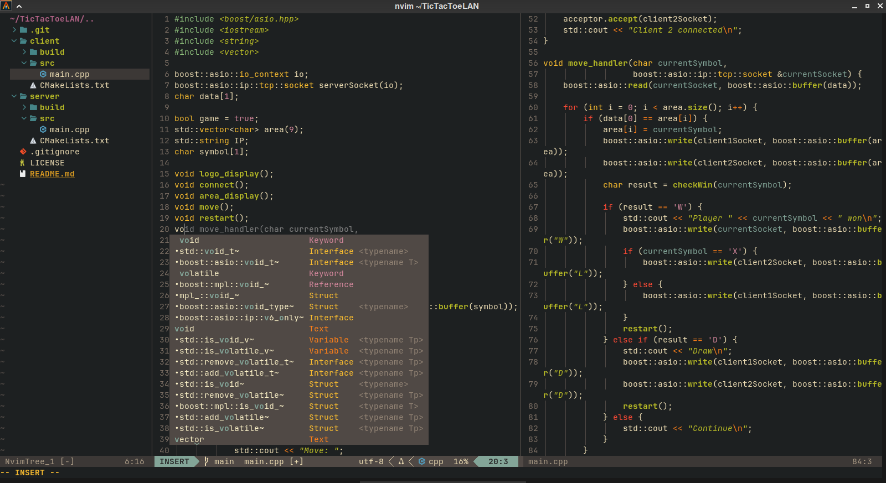

# Neovim config adapted for C++

Features autocomplete, codeium for code hints, and other conveniences.

---
### Screenshot

# Конфигурация Neovim, адаптированная для C++

Включает автодополнение, codeium для подсказок по коду и другие удобные функции.

