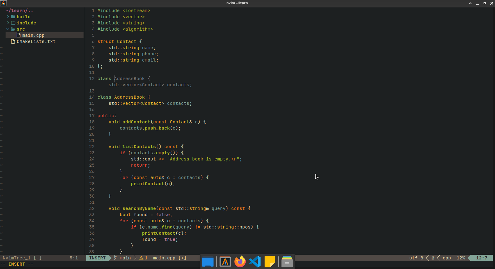

# Neovim Config

- Lazy.nvim + plugins: Treesitter, LSP (clangd), nvim-cmp, gruvbox (hard), nvim-tree, lualine, autopairs, toggleterm, codeium  
- F5 — compile and run C++  
- Ctrl+n — toggle file tree  
- Ctrl+l — accept Codeium suggestion  
- Splits: <Leader>v (vertical), <Leader>s (horizontal)

---

## Screenshots

This is **not a learning project**

---

# Конфиг Neovim

- Lazy.nvim + плагины: Treesitter, LSP (clangd), nvim-cmp, gruvbox (hard), nvim-tree, lualine, autopairs, toggleterm, codeium  
- F5 — сборка и запуск C++  
- Ctrl+n — файловое дерево  
- Ctrl+l — принять подсказку Codeium  
- Сплиты: <Leader>v (вертикальный), <Leader>s (горизонтальный)

---

Это **не учебный проект**
